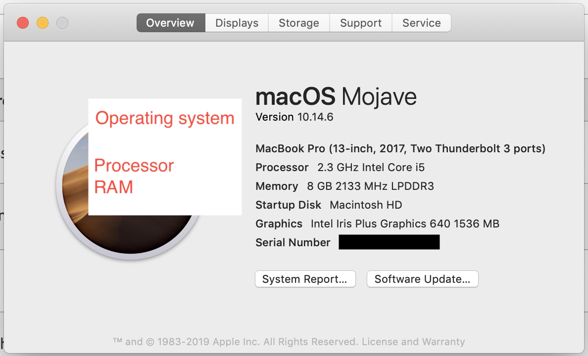

# Checking if your computer meets minimum system requirements

1. The minimum system requirements for running Audition can be found [here](https://helpx.adobe.com/audition/system-requirements.html) \(scroll down for macOS.\)
2. To see your computer's specs \(processor, operating system, RAM\), click the **Apple** icon \(upper-right\) and select **About This Mac**. \(Note: The operating system version number will be listed under the name of the operating system. See image below.\) 
3. To see the amount of space available on your computer, click the **Apple** icon \(upper-right\) and select **About This Mac**. Then click the **Storage** tab.

